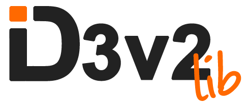

> Click [here](https://github.com/larsbs/id3v2lib/blob/d8c9f3ff27dbf82d8136550efd8de334d688e21e/README.md) to view the docs for version 1.0.
单击[此处](https://github.com/larsbs/id3v2lib/blob/d8c9f3ff27dbf82d8136550efd8de334d688e21e/README.md)查看1.0版的文档。

id3v2lib is a library written in C to read and edit id3 tags from mp3 files. It's focused on the ease of use.
id3v2lib是一个用C编写的库，用于读取和编辑mp3文件中的id3标签。它专注于易用性。

It is licensed under a BSD License. See [LICENSE](LICENSE) for details.
它是根据BSD许可证获得许可的。有关详细信息，请参阅[许可证]（许可证）。

## Table Of Contents
目录

- [Table Of Contents](#table-of-contents)
- [What Can It Do?](#what-can-it-do-)
- [Building and Installing](#building-and-installing)
  * [Building Using GNU Make in UNIX Systems](#building-using-gnu-make-in-unix-systems)
  * [Building Using CMake](#building-using-cmake)
- [Usage](#usage)
- [API](#api)
  * [File Functions](#file-functions)
  * [Tag Functions](#tag-functions)
    + [Getter Functions](#getter-functions)
    + [Setter Functions](#setter-functions)
    + [Delete Functions](#delete-functions)
- [Examples](#examples)
    + [Load Tags](#load-tags)
    + [Edit Tags](#edit-tags)
    + [Delete Tags](#delete-tags)
- [Extending Functionality](#extending-functionality)
    + [Read New Frames](#read-new-frames)
    + [Edit New Frames](#edit-new-frames)
- [Compatibility Layer](#compatibility-layer)
- [Projects](#projects)
- [Copyright](#copyright)
- [Questions?](#questions-)

## What Can It Do?
它能做什么？

id3v2lib can read and edit id3 v2.3 and v2.4 tags from mp3 files. However, it's not compatible with id3v1 tags. By default, it can read and edit a small subset of well known tags. Specifically:
id3v2lib可以从mp3文件中读取和编辑id3v2.3和v2.4标签。但是，它与id3v1标签不兼容。默认情况下，
它可以读取和编辑一小部分众所周知的标签。明确地


* Title 标题
* Album 专辑
* Artist 艺术家
* Album Artist 专辑艺术家
* Comment 注释
* Genre 体裁
* Year 年
* Track 轨道
* Disc Number 光盘编号
* Album Cover 专辑封面

However, the library can be extended in a very easy way, to read all the tags available.
然而，可以以一种非常简单的方式扩展库，以读取所有可用的标签。

## Building and Installing
构建和安装

### Building Using GNU Make in UNIX Systems
在UNIX系统中使用GNU Make构建

To build the library using Make, simply cd into the project's folder and run:
要使用Make构建库，只需cd到项目的文件夹中并运行：

```bash
$ make
```

After the building step is finished, you'll find the compiled library inside the `lib` folder.
构建步骤完成后，您将在“lib”文件夹中找到已编译的库。

### Building Using CMake
使用CMake构建

It's possible to use CMake 3.1+ to build id3v2lib on most platforms. To build and install the library, navigate into the project's directory and then run the following commands:
可以使用CMake 3.1+在大多数平台上构建id3v2lib。要构建和安装库，请导航到项目的目录，然后运行以下命令

```bash
$ mkdir build && cd build
$ cmake ..
$ cmake --build .
$ cmake --install .
```

It's possible that *su* privileges will be needed for the installation step.
安装步骤可能需要*su*权限。

> By default a **static version** of the library will be generated. However, If a shared library is required, the output library type can be easily toggled with `-DBUILD_SHARED_LIBS=ON` or `-DBUILD_SHARED_LIBS=OFF`
默认情况下，将生成库的**静态版本**。但是，如果需要共享库，则可以使用`-DBUILD_shared_LIBS=ON`或`-DBUILD_shared.LIBS=OFF轻松
切换输出库类型`

## Usage
使用

Include the main header of the library:
包含库的主要头文件：

```C
#include <id3v2lib.h>

int main(int argc, char* argv[])
{
  // Etc..
}
```

And then, link against the library during compilation:
然后，在编译过程中链接到库：

```bash
$ gcc -o example example.c -lid3v2lib
```

## API

Every intended public facing function or type is prefixed with `ID3v2_` to help with autocompletion, prevent conflicts and make identifying wich functions belong to the public API and which functions belong to the internal API easier.
每个预期的面向公众的函数或类型都以`ID3v2_`为前缀，以帮助自动完成，防止冲突，并使识别哪些函数属于公共API，
哪些函数属于内部API更容易。

### File Functions
文件函数

These functions interacts directly with the file to edit:
这些函数直接与要编辑的文件交互：

* `ID3v2_TagHeader* ID3v2_read_tag_header(const char* file_name)`
* `ID3v2_Tag* ID3v2_read_tag(const char* file_name)`
* `void ID3v2_write_tag(const char* file_name, ID3v2_Tag* Tag)`
* `void ID3v2_delete_tag(const char* file_name)`

Alternatively, there's another set of functions that will take a buffer as an argument instead of a file name in case that's preferred/needed:
或者，还有另一组函数将缓冲区作为参数，而不是首选/需要的文件名：

 * `ID3v2_TagHeader* ID3v2_read_tag_header_from_buffer(const char* buffer)`
 * `ID3v2_Tag* ID3v2_read_tag_from_buffer(const char* buffer, const int size)`

### Tag Functions
标签函数

These functions interacts with the different frames found in the tag. For the most used frames, a set of specific functions is provided. In case less known frames need to be manipulated, general purpose functions that interact with any frame id are also provided. More in the section about [extending functionality](extending_functionality).
这些函数与标签中的不同帧相互作用。对于最常用的帧，提供了一组特定的功能。在需要操纵鲜为人知的帧的情况下，
还提供了与任何帧id交互的通用功能。有关[扩展功能]（extending_formationary）的部分中有更多内容。


#### Getter Functions
获取函数

Retrieve information from a frame, they have the following name pattern:
从帧中检索信息，它们具有以下名称模式：

* `ID3v2_Tag_get_[frame]_frame` where frame is the name of the desired frame to find. It can be one of the previously mentioned tags.
`ID3v2_Tag_get_[frame]_frame`其中frame是要查找的所需帧的名称。它可以是前面提到的标签之一。

#### Setter Functions
设置函数

Set new information in a frame, they have the following name pattern:
在帧中设置新信息，它们具有以下名称模式：

* `ID3v2_Tag_set_[frame]` where frame is the name of the desired frame to edit. It can be one of the previously mentioned tags.
`ID3v2_Tag_set_[frame]`其中frame是要编辑的所需帧的名称。它可以是前面提到的标签之一。

#### Delete Functions
删除函数

Delete frames from the tag, they have the following name pattern:
从标记中删除帧，它们具有以下名称模式：

* `ID3v2_Tag_delete_[frame]` where frame is the name of the desired frame to delete. It can be one of the previously mentioned tags.
`ID3v2_Tag_delete_[frame]`其中frame是要删除的所需帧的名称。它可以是前面提到的标签之一。

## Examples
实例

For more examples, go to the [test](test) folder.
有关更多示例，请转到[test]（test）文件夹。

#### Load Tags
加载标签

```C
ID3v2_tag* tag = ID3v2_read_tag("file.mp3"); // Load the full tag from the file
                                             // 从文件加载完整标签

// Alternatively, the buffer version can be used
// 或者，可以使用缓冲版本

// ID3v2_Tag* tag = ID3v2_read_tag_from_buffer(buffer, size);

if(tag == NULL)
{
  tag = ID3v2_Tag_new();
}

// Read data from the tag
// 从标签中读取数据
ID3v2_TextFrame* artist_frame = ID3v2_Tag_get_artist_frame(tag);
printf("artist: %s", artist_frame->text); // this only works if encoding = ISO
                                          // 仅当编码=ISO时才有效

ID3v2_TextFrame* album_frame = ID3v2_Tag_get_album_frame(tag);
printf("album: %s", album_frame->text); // this only works if encoding = ISO
                                        // 仅当编码=ISO时才有效
```

#### Edit Tags
编辑标签

```C
ID3v2_tag* tag = ID3v2_read_tag("file.mp3"); // Load the full tag from the file
                                             // 从文件加载完整标签

// Alternatively, the buffer version can be used
// 或者，可以使用缓冲版本
// ID3v2_Tag* tag = ID3v2_read_tag_from_buffer(buffer, size);

if(tag == NULL)
{
  tag = ID3v2_Tag_new();
}

// Set the new info
// 设置新的信息
ID3v2_Tag_set_title(tag, ID3v2_to_unicode("Title"));
ID3v2_Tag_set_artist(tag, ID3v2_to_unicode("Artist"));

// Write the updated tag to the file
// 写入跟新后的标签到文件
ID3v2_write_tag("file.mp3", tag);
```

#### Delete Tags
删除标签

```C
ID3v2_tag* tag = ID3v2_read_tag("file.mp3"); // Load the full tag from the file
                                             // 从文件加载完整标签

// Alternatively, the buffer version can be used
// 或者，可以使用缓冲版本
// ID3v2_Tag* tag = ID3v2_read_tag_from_buffer(buffer, size);

if(tag == NULL)
{
  tag = ID3v2_Tag_new();
}

// We can delete single frames
// 我们可以删除单个帧
ID3v2_Tag_delete_title(tag);
ID3v2_Tag_delete_artist(tag);

// Write the new tag to the file
// 将新标记写入文件
ID3v2_write_tag("file.mp3", tag);

// Or we can delete the full tag
// 或者我们可以删除完整的标签
ID3v2_delete_tag("file.mp3")
```

## Extending Functionality
扩展功能

In case you need to read more esoteric frames than the ones provided by default, the library can be extended very easily to fit your needs.
如果您需要阅读比默认情况下提供的帧更深奥的帧，则可以很容易地扩展库以满足您的需求。

#### Read New Frames
读取新的帧

Suppose we want to read the frame that stores the copyright message (TCOP). We have to do the following:
假设我们想要读取存储版权消息（TCOP）的帧。我们必须做到以下几点：

```C
ID3v2_tag* tag = ID3v2_read_tag("file.mp3"); // Load the full tag from the file
                                             // 从文件加载完整标记

// Alternatively, the buffer version can be used
// 或者，可以使用缓冲版本
// ID3v2_Tag* tag = ID3v2_read_tag_from_buffer(buffer, size);

if(tag == NULL)
{
  tag = ID3v2_Tag_new();
}

// That's it, the only extra bit necessary here is taking into account that TCOP is a
// text frame and we have to do the casting manually.
// 就是这样，这里唯一需要的是考虑到TCOP是一个文本帧，我们必须手动进行转换。
ID3v2_TextFrame* copyright_frame = (ID3v2_TextFrame*) ID3v2_Tag_get_frame(tag, "TCOP");
printf("copyright: %s", copyright_frame->text); // this only works if encoding = ISO
```

#### Edit New Frames
编辑新帧

Suppose that now, we want to edit the copyright frame. We have to do the following:
假设现在，我们想要编辑版权帧。我们必须做到以下几点：

```C
ID3v2_tag* tag = ID3v2_read_tag("file.mp3"); // Load the full tag from the file
                                             // 从文件加载完整标记

// Alternatively, the buffer version can be used
// 或者，可以使用缓冲版本
// ID3v2_Tag* tag = ID3v2_read_tag_from_buffer(buffer, size);

if(tag == NULL)
{
  tag = ID3v2_Tag_new();
}

// Since TCOP is a text frame, we have to use the generic function that deals
// with text frames. There's another generic function to deal with comment frames
// and another one that deals with apic frames.
// 由于TCOP是一个文本帧，我们必须使用处理文本帧的通用函数。还有另一个通用函数用于处理注释帧，
// 还有一个用于处理apic帧。

ID3v2_Tag_set_text_frame(tag, &(ID3v2_TextFrameInput) {
  .id = "TCOP",
  .flags = "\0\0",
  .text = "A copyright message"
});
```

## Compatibility Layer
兼容性层

In case you're not able to migrate your code to the new version of the library, a compatibility layer is provided that will make use of the new internals while presenting the old API. However, it's recommended that whenver possible, a full migration to the new API is done as the maintenance of this compatibility layer is not guarantee for future versions.
如果您无法将代码迁移到库的新版本，将提供一个兼容层，该层将在呈现旧的API的同时使用新的内部结构。但是，建议尽可能完全迁移到新的API，因为该兼容性层的维护不能保证将来的版本。

To use the compatibility layer simply include `id3v2lib.compat.h` instead of the regular one. This will allow you to keep using the old functions but using the revamped code internally.
要使用兼容性层，只需包括“id3v2lib.compat.h”而不是常规层。这将允许您继续使用旧函数，但在内部使用经过修改的代码。

```C
#include <id3v2lib.compat.h>

void main()
{
    ID3v2_tag* tag = load_tag("file.mp3");
    if (tag == NULL) tag = new_tag();

    ID3v2_frame* album_frame = tag_get_album(tag);
    ID3v2_frame_text_content* album_content = parse_text_frame_content(album_frame);
    printf("Album: %s", album_content->data);
}
```

## Projects
项目

Is your project is using this library? Let me know it and I'll add it here!
你的项目正在使用这个库吗？让我知道它，我会在这里添加它！

## Copyright
版权

Copyright (c) 2013 Lars Ruiz. See [LICENSE](LICENSE) for details.
版权所有（c）2013 Lars Ruiz。有关详细信息，请参阅[许可证]（许可证）。

## Questions?
问题

If you have any questions or suggestions, please feel free to ask or raise an issue.
如果您有任何问题或建议，请随时提出问题。
